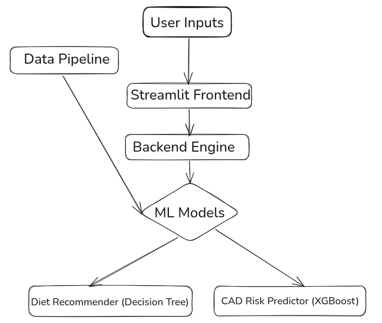

# 🫀 Coronary Artery Disease Predictor & Lifestyle Solution

## 🏥 Dr. CardiOS: Predict. Prevent. Protect.



## 📊 1. Real-World Context

Coronary Artery Disease (CAD) is the **leading cause of death in North America**, responsible for:

* **~375,000+ deaths/year in the U.S.** (CDC, 2023)  
* **20%+ of all deaths in Canada** (Health Canada, 2022)

  Most CAD cases go undetected until severe events (e.g., myocardial infarction). Early risk assessment plus targeted lifestyle intervention can reduce incidence by up to **30%**.

---

## 🎯 2. Problem Definition & Approach

**Problem**: Lack of accessible, transparent tools for early CAD risk prediction and personalized lifestyle guidance.

**Approach**:

1. **Data Fusion**: Merge five public clinical cohorts (UCI, Framingham, population survey, Z‑Alizadeh Sani) totaling \~\~76k records.
2. **Interpretable ML**: Train logistic regression, random forest, and finalize with XGBoost for best AUC while maintaining explainability.
3. **Diet Integration**: Leverage two diet‑recommendation datasets to map clinical risk profiles to tailored meal plans.
4. **Intuitive UI**: Build a Streamlit frontend with health facts, risk gauge, and hanging “sticky-note” advice.

This hybrid design solves both **prediction** and **prevention**, empowering users to understand and act on their heart health.

---

## 📚 3. Dataset Sources

| Dataset                                   | Records | Features                                       | Source                                                                                             |
| ----------------------------------------- | ------: | ---------------------------------------------- | -------------------------------------------------------------------------------------------------- |
| Z‑Alizadeh Sani Clinical Cohort           |     303 | 54 echo, lab, family history features          | [UC Irvine](https://archive.ics.uci.edu/static/public/412/z+alizadeh+sani.zip) 
| Framingham Heart Study                    | \~4,240 | Age, BP, BMI, glucose, cholesterol, smoking    | [Kaggle](https://www.kaggle.com/datasets/aasheesh200/framingham-heart-study-dataset)               |
| UCI Heart Disease (Cleveland)             |     303 | Chest pain, ECG, thal, slope                   | [Kaggle](https://www.kaggle.com/datasets/cherngs/heart-disease-cleveland-uci)                      |
| UCI Merged Cohorts (Hungary, Switzerland) | \~1,025 | Combined clinical + ECG metrics                | [Kaggle](https://www.kaggle.com/datasets/johnsmith88/heart-disease-dataset)                        |
| Cardiovascular Disease (Population)       |  70,000 | Demographics, vitals, lifestyle                | [Kaggle](https://www.kaggle.com/datasets/colewelkins/cardiovascular-disease)                       |                      |
| Personalized Diet Recommendations         | \~5,000 | Demographics, vitals, macros, meal plan        | [Kaggle](https://www.kaggle.com/datasets/ziya07/personalized-medical-diet-recommendations-dataset) |
| Disease-Specific Diet Dataset             | \~1,000 | Demographics, disease, activity, diet category | [Kaggle](https://www.kaggle.com/datasets/ziya07/diet-recommendations-dataset)                      |

---

## 🧠 4. How the ML Models Were Developed & Trained

### CAD Risk Model

1. **Preprocessing**: Standardize column names, encode binaries, drop features >30% null, impute median/mode.
2. **Feature Selection**: Compute correlation with CAD label; select top 10 (age, sex, BMI, BP, cholesterol, chest pain type, ECG slope, thalassemia, smoking).
3. **Modeling**: Train three classifiers:

   * **Logistic Regression** (baseline interpretability)
   * **Random Forest** (robust to missing data & interactions)
   * **XGBoost** (final: tuned for highest AUC using `GridSearchCV` on `n_estimators`, `max_depth`)
4. **Evaluation**: Use stratified 80/20 split; metrics: AUC, precision, recall; XGBoost achieved **AUC ≈0.82**.
5. **Serialization**: Save final pipeline (scaler + model) as `models/cad_merged_pipeline.pkl`.

### Diet Recommendation Model

1. **Preprocessing**: Merge two diet CSVs on overlapping features; encode diet recommendations as categorical.
2. **Modeling**: Train a **Decision Tree** (max\_depth=4, `class_weight='balanced'`) for clear decision paths.
3. **Evaluation**: 5-fold cross-validation; accuracy >75%.
4. **Serialization**: Save as `models/diet_rec_model.pkl` and processed lookup `data/processed/diet_lookup.pkl`.

---

## ⚙️ 5. Integration into the App

1. **App Startup**: Load `cad_merged_pipeline.pkl`, `diet_rec_model.pkl`, and `diet_lookup.pkl`.
2. **User Input**: Streamlit form collects the 10 CAD features.
3. **Risk Prediction**: Pipeline `.predict_proba()` yields CAD risk; displayed via Plotly gauge.
4. **Diet Advice**: Input same features into `diet_rec_model.predict()`; lookup macro targets from `diet_lookup.pkl`; display in a styled card.
5. **Motivational Facts**: Render floating “sticky-note” boxes with CAD facts and tips.

---

## 🚀 6. Usage & Deployment

### Prerequisites

```bash
pip install -r requirements.txt
```

### Run Locally

```bash
streamlit run src/frontend/app.py
```

### Live Demo

*Deployment link soon*

---

## 📂 7. Repo Structure

```
CardioSage/
├── data/
│   ├── raw/
│   └── processed/
├── models/
├── src/
│   ├── backend/
│   └── frontend/
├── docs/
├── demo/
├── README.md
└── requirements.txt
```

---

## 🏆 8. Why CardioSage Wins

* **Transparent**: All data & code open-source—no black-box APIs.
* **Interpretable**: Models chosen for insight and accuracy.
* **Holistic**: Risk + actionable diet + motivation.
* **Lightweight**: Runs on CPU, deployable anywhere.

